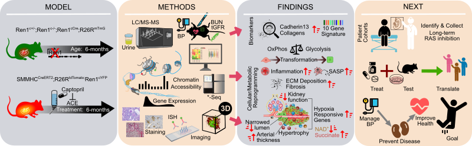

# Hypoxia-Induced Metabolic Reprogramming and Markings of Cell Fate in Concentric Arterial Hypertrophy

Included here are the steps to analyze and product figures related to sequencing data from ["Hypoxia-Induced Metabolic Reprogramming and Markings of Cell Fate in Concentric Arterial Hypertrophy"](https://www.biorxiv.org/content/10.1101/2025.07.09.663881v1).

|  |
|:--:|
| **Models of chronic RAS disruption that induces renal decline reveal metabolic and cellular reprogramming**. Two mouse models with fluorescent lineage tracing were employed to perform comprehensive measurements of the consequences of RAS disruption including: proteomics/metabolomics, single-cell RNA-seq and ATAC-seq, renal function, and kidney cellular morphology/histology. This approach revealed metabolic shifts, increased inflammation, fibrosis, reductions in renal function, and early biomarkers of arteriolar hypertrophy because of RAS inhibition. Moving forward, there is a need for human cohorts under long-term RAS inhibition to be evaluated in greater detail to confirm early detection strategies.  Continued animal work is necessary to test therapeutic strategies so that future translational approaches can continue to manage hypertension without kidney damage. |

