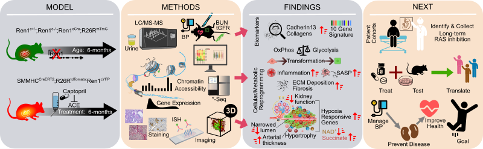

# Chronic RAAS Suppression Drives Hypoxic Metabolic Reprogramming and Vascular Remodeling in the Kidney

Included here are the steps to analyze and product figures related to sequencing data from ["Chronic RAAS Suppression Drives Hypoxic Metabolic Reprogramming and Vascular Remodeling in the Kidney"](https://www.biorxiv.org/content/10.1101/2025.07.09.663881v1).

|  |
|:--:|
| Chronic inhibition of the renin-angiotensin-aldosterone system (RAAS), a cornerstone of antihypertensive therapy, drives concentric arterial and arteriolar hypertrophy (CAAH), a progressive renal vascular disease whose molecular and metabolic basis remained undefined. Structural injury precedes detectable kidney function decline, creating a window during which disease advances silently. Three-dimensional vascular imaging reveals the extent of this remodeling, with luminal narrowing spanning the renal arterial tree. In mouse models of genetic and pharmacologic RAAS suppression, fate-mapping shows that renin cells and their smooth muscle descendants adopt inflammatory, fibrotic, and secretory states accompanying progressive vessel wall thickening. Integrating single-cell transcriptomics, proteomics, and metabolomics, we identify a conserved hypoxia-associated metabolic program marked by glycolytic shift and impaired mitochondrial function. This analysis also yields a 10-gene molecular signature of CAAH validated in independent human kidney disease cohorts. Candidate urinary biomarkers establish a framework for non-invasive detection of this incompletely understood vascular pathology. |

